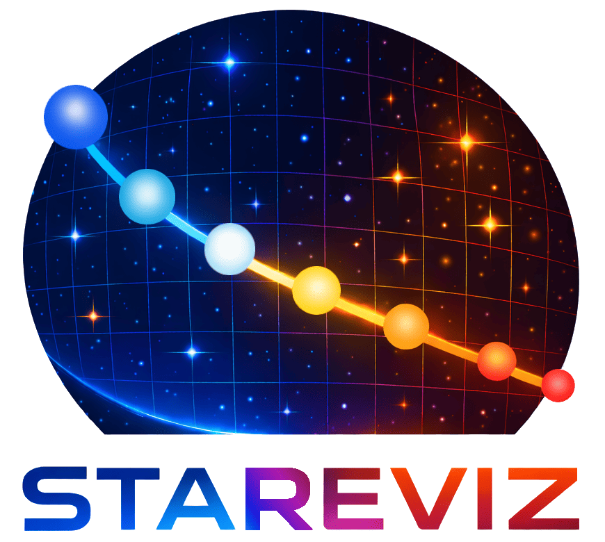

# STAREVIZ
<p align="left">
  
</p>

**Interactive browser-based visualizer for [STAREVOL](https://obswww.unige.ch/Research/evol/starevol/starevol.php) stellar evolution models.**

Built with [Dash](https://dash.plotly.com/) + [Plotly](https://plotly.com/python/). Runs entirely on your local machine and opens in your default web browser.

📖 **[Full User Manual](stareviz/docs/STAREVIZ_manual.pdf)**

---

## Features

| Feature | Description |
|---|---|
| **HR diagram & arbitrary 2D plots** | Any parameter on X/Y: Teff, L, logg, age, mass, rotation, abundances, … |
| **Kippenhahn diagram** | Convective zones, thermohaline mixing, phase-coded radiative background |
| **Isochrones** | Connect equal-age points across models; configurable sort order and styling |
| **Freeze / snapshot overlay** | Freeze the current plot as a semi-transparent background layer |
| **Evolutionary phase coloring** | Color tracks by phase (PMS / MS / SGB+RGB / HB / AGB) |
| **Abundance formats** | X(X), A(X), [X/H], [X/M] — computed on the fly from mass fractions |
| **Fast mode** | Load only `.hr` files for quick HR/Kiel diagram browsing of large grids |
| **Multi-model loading** | Search and load any number of models; sidebar checklist with live search |
| **Multi-model folders** | Folders with multiple model files are shown as collapsible groups in the sidebar |
| **Per-model cache reload** | 🔄 button on hover reloads a single model from disk without restarting the app |
| **Export to PNG** | Auto-named output files (e.g. `Li7surf_vs_Age_3_models.png`) |
| **Fully configurable** | Colors, line widths, font sizes, grid, legend, etc. — all via `stareviz.yml` |

---

## Requirements

- Python ≥ 3.9

All Python dependencies are installed automatically via `pip install -e .`

---

## Installation

```bash
git clone https://github.com/bsviat/stareviz.git
cd stareviz
pip install -e .
```

The `stareviz` command is immediately available after installation.

---

## Usage

```bash
# If the path to directories containing STAREVOL model folders (usually, RESEVOL) is defined in stareviz.yml:
stareviz

# If you want to use a different path:
stareviz /path/to/models

# Custom port (default: 8050)
stareviz /path/to/models --port 8080
```

A browser tab opens automatically at **http://127.0.0.1:8050**.

### Set default directories

To avoid passing paths every time, add them to `stareviz.yml`:

```yaml
default_roots:
  - ~/STAREVOL/RESEVOL/
```

Then just run:

```bash
stareviz
```

---

## Interface overview

The interface is divided into two areas: a **control panel** on the top and a **plot** on the bottom.

### Model management

- **Search** — type any substring of a folder name (e.g. `"1.02"` for stellar mass) to find models; click to add
- **Loaded models checklist** — check/uncheck models; each gets a unique color on the plot; the box is vertically resizable
- **Multi-model folders** — if a folder contains several model files, it appears as a collapsible group with a bold header (e.g. `▼ M1.16Z014227... [3]`); click the header to expand/collapse
- **🔄 Reload** — hover over a model name to reveal a reload button; click it to clear that model's cache and re-read its files from disk without restarting
- **Clear selection** — uncheck all models at once; unchecked models stay cached for instant re-selection
- **Fast mode** — load only `.hr` files (HR/Kiel diagrams only, no abundances or Kippenhahn); useful for large grids

### Axis controls

Each axis has a **Category** dropdown and a **Parameter** dropdown.

Available categories: *Basic, Abundance ratios, Abundances (surface/center), Convection, Rotation, Central, Energetics, H/He/C/Ne burning, Conv turnover (env/core), Asteroseismic*

- **Scale** — Lin / Log / Log(X) per axis; forced automatically for logg, A(X), [X/H], [X/M]
- **⇄ Swap axes** — swaps X and Y including scale settings
- **Abundance format** — X(X) / A(X) / [X/H] / [X/M] selector appears when an abundance parameter is selected
- **Age units** — Gyr / Myr / yr selector appears when Age is on a linear axis

### Age slider and isochrones

The **Age slider** marks a specific age on all loaded tracks simultaneously. The selected age can be changed via the slider, typed in directly (Myr, non-integer numbers are also accepted), or incremented with ±1 Myr arrows.

When **two or more models** are loaded, a **Show isochrone** checkbox appears. Enabling it draws an isochrone connecting equal-age points across all models at the selected age.

> Age markers are shown as circles; for tracks that end before the selected age, a square is used instead.
> If you want to remove the age markers, set the Age slider to 0.

### Evolutionary phases

Enable **Show phase** to color each track segment by evolutionary phase:

| Phase | Default color | Description |
|---|---|---|
| 1 — Pre-main Sequence | cyan | Fully convective, before hydrogen ignition |
| 2 — Main Sequence | black | Core hydrogen burning |
| 3 — SGB / RGB | green | Hertzsprung gap and RGB ascent |
| 4 — Horizontal Branch | blue | Core helium burning |
| 5 — AGB | red | Shell burning, second dredge-up |

Two numeric inputs set a **phase range** — useful to isolate, e.g., only MS and RGB.

### Freeze plot

Click **Freeze plot** to snapshot the current plot as a background layer. Then change axis parameters, models, or any other settings — the frozen layer stays visible for comparison. Press **Freeze plot** again to add another layer on top; repeat as many times as needed. Older layers fade progressively so the most recent one is always most visible. Click **Clear frozen** to remove all frozen layers except the most recent one; click again to clear the last remaining layer.

### Kippenhahn diagram

Select *Kippenhahn diagram* from the Y-axis dropdown (category *Basic*). The X-axis is automatically set to Age.

| Element | Meaning |
|---|---|
| Background | Radiative zone, color-coded by phase (PMS = light blue, MS = yellow, SGB = orange, HB = salmon, AGB = pink) |
| Green fill with rings | Convective zones (envelope + internal zones) |
| Red/pink fill | Thermohaline mixing zone |
| Colored fills (opt-in) | H / He / C / Ne burning zones — enable via `show_Hburn`, `show_Heburn`, `show_Cburn`, `show_Neburn` in `stareviz.yml` |

The Y-axis can be switched between **mass coordinates** (M_r/M_total, default) and **radius coordinates** (R_r/R_total, linear or logarithmic) via the Y-axis scale options.

> Kippenhahn view renders only the first selected model. Swap axes and X-axis dropdown are disabled in this mode.

### Exporting plots

Use the Plotly modebar (top-right of the plot) → **Download plot as PNG**. The filename is auto-generated from axis parameter names and the number of loaded models, e.g. `Li7surf_vs_Age_3_models.png`.

---

## Configuration

The configuration file `stareviz.yml` is located in the same folder as the STAREVIZ code.
You can check it by `which stareviz` in your shell terminal.

> All options are documented inline in `stareviz.yml`. See also [Section 9 of the User Manual](docs/manual.pdf) for a full reference.

> **Note:** the config file is read once at startup. Restart STAREVIZ after editing.

---

## Model directory layout

STAREVIZ expects each model in its own subdirectory:

```
RESEVOL/
├── M1.0_Z0.014_AAD_v0/
│   ├── *.hr            ← main track (Teff, L, logg, age, …)
│   ├── *.v1 … *.v13   ← internal structure
│   ├── *.s1 … *.s4    ← surface abundances
│   ├── *.c1 … *.c4    ← central abundances
│   ├── *.as            ← extra surface quantities
│   └── *.tc1, *.tc2   ← convective boundaries (Kippenhahn)
├── M1.5_Z0.014_AAD_v0/
│   └── …
```

Gzipped files (`.gz`) are supported.

---

## Project structure

```
stareviz/
├── app.py           # Dash layout and callbacks
├── loader.py        # STAREVOL file reader
├── registry.py      # Model index, sorting, LRU cache
├── viz_config.py    # YAML config loader
├── constants.py     # Axis labels, chemical compositions, atomic masses
├── utils.py         # Axis scale helpers
├── cli.py           # Entry point  (stareviz command)
├── stareviz.yml     # Default user configuration
└── assets/
    ├── logo.png     # Logo of the tool
    └── favicon.ico  # Mini logo used in the browser's tab
docs/
└── STAREVIZ_manual.pdf      # Full user manual
```

---

## Troubleshooting

| Problem | Solution |
|---|---|
| No models in sidebar | Check that root directories contain subfolders with `.hr`, `.v*`, or `.s*` files. STAREVIZ scans recursively. |
| Empty plot for a parameter | The required auxiliary file (e.g. `.s1` for surface abundances) may be absent, or not yet loaded — wait for background loading to finish. |
| Port already in use | Use `--port 8080` (or any free port), or run `lsof -ti:8050 \| xargs kill -9` to free the default port. |
| Swap axes button disabled | Kippenhahn diagram is selected on Y — Age must always be the X-axis in this mode. |
| Config changes not reflected | `stareviz.yml` is read once at startup. Restart STAREVIZ after editing. |
| Slow initial load | First load reads all auxiliary files. Subsequent selections use the in-memory cache and are near-instant. |

---

## Contact

Bug reports, feature requests, and questions: **borisov.sviat@gmail.com**

---

## License

MIT — see [LICENSE](LICENSE)
